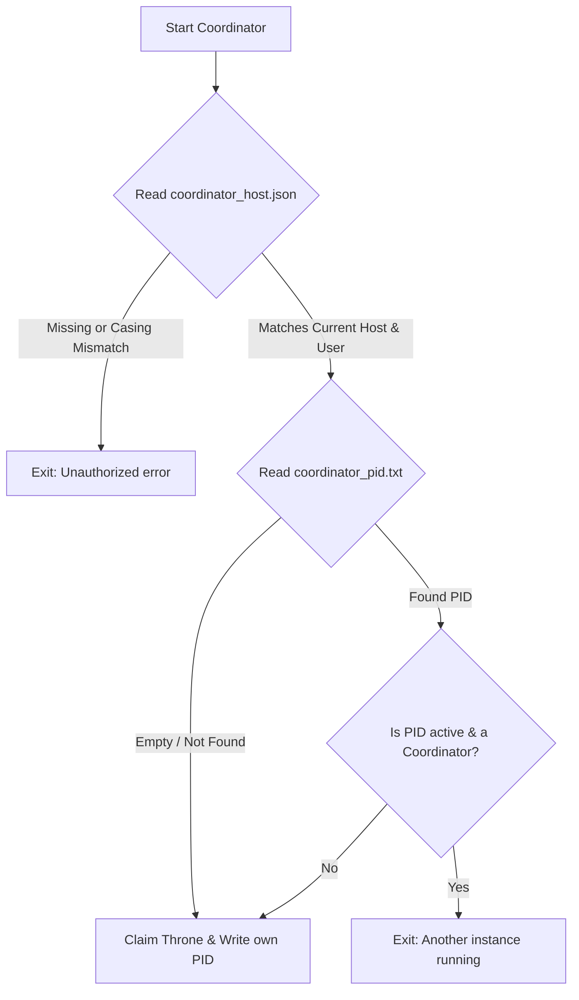

# Coordinator Operations & Recovery Runbook

This document provides system administrators with the necessary instructions to deploy, monitor, and recover the `shikibo` coordinator service.

---

## 1. Initial Setup & Host Authorization

To prevent unauthorized machines or multiple processes from running the coordinator, the system requires an explicit host authorization file.

### Setup Procedure
Create a file named `coordinator_host.json` inside the synchronized root directory at:
`<root_dir>/system/config/coordinator_host.json`

The file must contain a JSON object specifying the authorized **hostname** and the **system user name** (real system login user, NOT the `shikibo` threadmail identity).

**Format of `coordinator_host.json`:**
```json
{
  "host": "authorized-hostname",
  "user": "system-user-name"
}
```

*Note: The coordinator performs case-insensitive comparisons on both fields.*

---

## 2. Managing the Coordinator Service

### Starting the Message Pump (Service mode)
To start the coordinator as a timed background daemon service:
```powershell
python -m shikibo service
```
You can optionally override the polling interval (default is 5 seconds) using the `-i` parameter:
```powershell
python -m shikibo service -i 10
```

### Running a One-Shot Scan
To execute a single outbox processing scan and exit immediately:
```powershell
python -m shikibo scan
```

### Stopping the Coordinator
To shut down a running coordinator, send a keyboard interrupt (`Ctrl+C`) or terminate the process. The coordinator will shut down cleanly.

---

## 3. Instance Prevention Mechanics

When the coordinator service is started in timed background daemon service mode (`python -m shikibo service`), it performs a two-tier safety validation check. Other commands (such as launching the WebApp, running a manual one-shot scan, or archiving) bypass these checks entirely.



### Failure Modes & Output Messages

#### Host/User Mismatch
If the host file is missing, the coordinator will fail with:
```
Error: Coordinator host configuration file is missing at:
  <root_dir>/system/config/coordinator_host.json
Please create this file with the following format:
  {
    "host": "your-machine-hostname",
    "user": "your-system-user"
  }
```
If the host file exists but specifies a different system:
```
Error: Unauthorized host/user configuration.
Authorized: host='authorized-hostname', user='system-user-name'
Current:    host='current-hostname', user='current-system-user'
```

#### Process Collision (PID check)
If another coordinator is running:
```
Error: Another coordinator process (PID 1234) is already running on this machine.
```

---

## 4. System Recovery & Troubleshooting

### Scenario A: Coordinator Crashed or Machine Lost Power (Orphaned PID Lock)
If the coordinator machine crash-reboots, `coordinator_pid.txt` will still contain the old PID. However, the system self-heals:
1. Upon restart, the coordinator reads `coordinator_pid.txt`.
2. It queries the operating system to check if that PID is active.
3. If no process is running under that PID, or if the process running at that PID is NOT a `shikibo` coordinator process (verified by checking its command line), the coordinator automatically overrides the lock, claims the throne, and updates the file with its new PID.

### Scenario B: Manual Recovery of Stuck/Stale Lock
If you must manually force a cleanup or force-restart the message pump:
1. Verify if any coordinator process is running:
   * **Windows**: Run `tasklist` or check Task Manager.
   * **Linux/POSIX**: Run `ps aux | grep shikibo`.
2. If a stale/zombie coordinator process is found, terminate it:
   * **Windows**: `taskkill /F /PID <stale_pid>`
   * **Linux**: `kill -9 <stale_pid>`
3. Delete the file `<root_dir>/system/coordinator/coordinator_pid.txt` (or let the new coordinator automatically overwrite it on startup).
4. Restart the message pump: `python -m shikibo service`.
