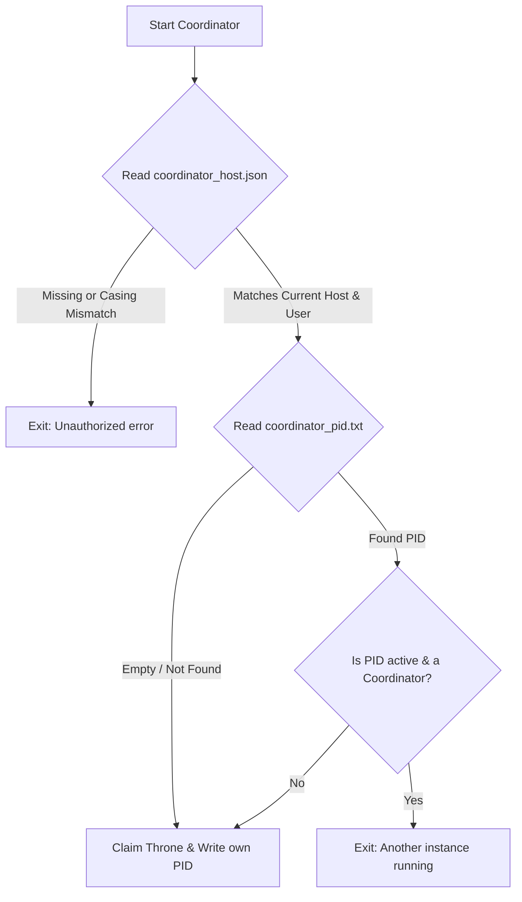

# Coordinator Operations & Recovery Runbook

This document provides system administrators with the necessary instructions to deploy, monitor, and recover the `shikibo` coordinator service.

---

## 1. Initial Setup & Host Authorization

To prevent unauthorized machines or multiple processes from running the coordinator, the system requires an explicit host authorization file.

### Setup Procedure
Create a file named `coordinator_host.json` inside the synchronized root directory at:
`<root_dir>/system/config/coordinator_host.json`

The file must contain a JSON object specifying the authorized **hostname** and the **system user name** (real system login user, NOT the `shikibo` threadmail identity).

**Format of `coordinator_host.json`:**
```json
{
  "host": "authorized-hostname",
  "user": "system-user-name"
}
```

*Note: The coordinator performs case-insensitive comparisons on both fields.*

---

## 2. Managing the Coordinator Service

### Starting the Message Pump (Service mode)
To start the coordinator as a timed background daemon service:
```powershell
python -m shikibo service
```
You can optionally override the polling interval (default is 5 seconds) using the `-i` parameter:
```powershell
python -m shikibo service -i 10
```

### Running a One-Shot Scan
To execute a single outbox processing scan and exit immediately:
```powershell
python -m shikibo scan
```

### Stopping the Coordinator
To shut down a running coordinator, send a keyboard interrupt (`Ctrl+C`) or terminate the process. The coordinator will shut down cleanly.

---

## 3. Instance Prevention Mechanics

When the coordinator service is started in timed background daemon service mode (`python -m shikibo service`), it performs a two-tier safety validation check. Other commands (such as launching the WebApp, running a manual one-shot scan, or archiving) bypass these checks entirely.



### Failure Modes & Output Messages

#### Host/User Mismatch
If the host file is missing, the coordinator will fail with:
```
Error: Coordinator host configuration file is missing at:
  <root_dir>/system/config/coordinator_host.json
Please create this file with the following format:
  {
    "host": "your-machine-hostname",
    "user": "your-system-user"
  }
```
If the host file exists but specifies a different system:
```
Error: Unauthorized host/user configuration.
Authorized: host='authorized-hostname', user='system-user-name'
Current:    host='current-hostname', user='current-system-user'
```

#### Process Collision (PID check)
If another coordinator is running:
```
Error: Another coordinator process (PID 1234) is already running on this machine.
```

---

## 4. System Recovery & Troubleshooting

### Scenario A: Coordinator Crashed or Machine Lost Power (Orphaned PID Lock)
If the coordinator machine crash-reboots, `coordinator_pid.txt` will still contain the old PID. However, the system self-heals:
1. Upon restart, the coordinator reads `coordinator_pid.txt`.
2. It queries the operating system to check if that PID is active.
3. If no process is running under that PID, or if the process running at that PID is NOT a `shikibo` coordinator process (verified by checking its command line), the coordinator automatically overrides the lock, claims the throne, and updates the file with its new PID.

### Scenario B: Manual Recovery of Stuck/Stale Lock
If you must manually force a cleanup or force-restart the message pump:
1. Verify if any coordinator process is running:
   * **Windows**: Run `tasklist` or check Task Manager.
   * **Linux/POSIX**: Run `ps aux | grep shikibo`.
2. If a stale/zombie coordinator process is found, terminate it:
   * **Windows**: `taskkill /F /PID <stale_pid>`
   * **Linux**: `kill -9 <stale_pid>`
3. Delete the file `<root_dir>/system/coordinator/coordinator_pid.txt` (or let the new coordinator automatically overwrite it on startup).
4. Restart the message pump: `python -m shikibo service`.

---

## 5. User Management (Statically Configured)

All user registration and folder setup is done statically by a human administrator. The WebApp and client services are restricted from programmatically creating or registering users.

### A. Adding a New User
To add a new participant to the system:
1. **Directory Setup**:
   Create the top-level user folder and their personal outbox/receipts subdirectories:
   ```
   <root_dir>/users/<user_id>/
   <root_dir>/users/<user_id>/outbox/
   <root_dir>/users/<user_id>/receipts/
   ```
2. **Access Permissions (OS-Level Isolation)**:
   * Configure the parent directory `users/` to be **read-only** for all client processes.
   * Grant **read/write** access to the registered user's system account for their own directory `users/<user_id>/`.
3. **Register the User**:
   Open the configuration file at `system/config/registered_users.txt` and append the `<user_id>` on a new line.
4. **Role Creation**:
   Users can create sub-role directories under their user folder (e.g. `users/<user_id>/developer/outbox`). All role names must strictly consist of alphanumeric characters and underscores (`^[a-zA-Z0-9_]+$`). Any folders violating this constraint will be automatically skipped by the coordinator during dynamic role discovery.

### B. Removing a User
To remove or disable a participant:
1. Open the file `system/config/registered_users.txt` and remove the user's name from the list.
2. *(Optional)* Revoke their write permissions or archive/delete their directory `users/<user_id>/`.

---

## 6. Changing Coordinator Host (Active Handover)

To safely migrate the active coordinator service to a new machine on the network, follow these instructions:

### Step-by-Step Migration Process
1. **(Optional) Shutdown Current Coordinator**:
   Directly stop the running coordinator service process on the active machine (e.g., via `Ctrl+C` or process termination tools).
2. **Update Configuration**:
   Edit `<root_dir>/system/config/coordinator_host.json` to define the new target `host` and system `user` authorized to run the service.
3. **Wait for Network Propagation**:
   Wait **5 minutes** to ensure the updated `coordinator_host.json` file is fully synchronized and reaches all active hosts on the network.
4. **Self-Termination of Old Coordinator**:
   If the old coordinator was *not* manually shut down in Step 1, it will automatically detect the configuration change. Upon starting its next pending messages dispatch loop, it will verify the new host settings, write the exit reason into its status file `<hostname>-<PID>.txt`, and safely self-terminate.
5. **Start New Coordinator**:
   Start the coordinator service on the new machine matching the updated `coordinator_host.json` config:
   ```powershell
   python -m shikibo service
   ```
